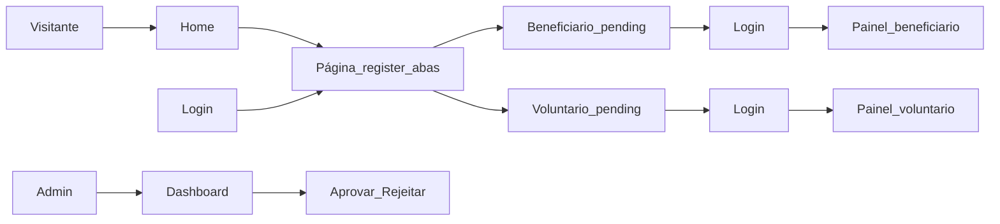

# PRD — Projeto Ser Luz (sistema web)

Documento de requisitos do produto para o sistema web da ONG **Projeto Ser Luz**.

**Convenção de idioma:** identificadores de código (campos de banco/API, enums, nomes de arquivos, rotas, chaves i18n técnicas) em **inglês**. Textos exibidos ao usuário (labels, botões, mensagens, páginas institucionais) em **português**.

---

## 1. Visão e contexto

| Item          | Descrição                                                                                                                                    |
| ------------- | -------------------------------------------------------------------------------------------------------------------------------------------- |
| **Produto**   | Sistema web institucional e operacional para a ONG **Projeto Ser Luz** (cidade de médio porte, Brasil) — apoio social (ex.: cestas básicas). |
| **Objetivos** | (1) Cadastro de quem precisa de ajuda e de voluntários; (2) gestão simples pela ONG; (3) presença institucional online.                      |
| **Públicos**  | **beneficiário**, **Voluntário**, **Admin**.                                                                                                      |

**Princípios de produto:** triagem manual da ONG (fora do fluxo automático no MVP); transparência de status para beneficiário/voluntário; dados sensíveis com acesso mínimo necessário.

---

## 2. Identidade visual e UI

**Paleta (obrigatória):**

- Amarelo: `#f0c657` — CTAs secundários, destaques, ícones de atenção.
- Azul: `#0e4cab` — header, links primários, botões primários, foco de marca.
- Branco: `#ffffff` — fundos de cards e áreas principais.
- Cinza claro: `#f5f5f5` — fundo de página, separação sutil de seções.

**Direção:** layout limpo, tipografia legível, espaçamento generoso; sensação **confiável** e **acessível**.

**Contraste:** texto principal em tons escuros sobre fundos claros; botões azul/amarelo com texto que atinja WCAG AA onde aplicável (validar com ferramenta de contraste no build).

**Uso sugerido:**

- Header fixo ou sticky: fundo azul, texto/branco, logo/nome em branco ou amarelo.
- Botão primário: fundo azul, texto branco; hover mais escuro.
- Botão secundário / destaque: amarelo com texto escuro.
- Links: azul; sublinhado no hover ou foco visível para teclado.

**Header (layout obrigatório):** à **esquerda**, logo (ou nome) da ONG; à **direita**, botão **Doar** (abre o mesmo modal de doação da home) e **ícone de usuário**. O ícone: se **não autenticado** → navega para `/login`; se **autenticado** → navega para o painel adequado ao `role` (`/painel/beneficiary`, `/painel/volunteer` ou `/admin`).

**Ativos estáticos (MVP):**

- **Logo:** ficheiro `public/logo.webp` no repositório da app (URL pública `/logo.webp`); usar no header como imagem da marca. Se o ficheiro não existir num dado ambiente, **fallback** para o **nome** da ONG em texto (mantém “logo ou nome”).
- **Favicon:** ficheiro `public/favicon.ico` (ícone de separador / navegador).

---

## 3. Perfis de usuário e papéis

| Role       | Código sugerido | Descrição                                                                 |
| ---------- | --------------- | ------------------------------------------------------------------------- |
| Admin      | `admin`         | Gestão total de cadastros, anotações internas, aprovação/rejeição.        |
| Voluntário | `volunteer`     | Cadastro próprio; painel para ver/editar dados (sem anotações de outros). |
| beneficiário    | `beneficiary`   | Cadastro próprio; painel para ver/editar dados permitidos e ver status.   |

**Fonte da verdade do role:** alinhada ao **Supabase Auth** (tabela `profiles` com `role`), com checagem no servidor (Nitro) em rotas sensíveis.

---

## 4. Estados de cadastro (status)

Aplicável a **beneficiário** e **voluntário** (campos distintos ou reutilizando enum `status`):

| Estado    | Código     | Comportamento esperado                                                                                                                                    |
| --------- | ---------- | --------------------------------------------------------------------------------------------------------------------------------------------------------- |
| Pendente  | `pending`  | Após envio do formulário; usuário pode logar com acesso limitado (ver/editar próprios dados; sem benefícios operacionais além do escopo definido no MVP). |
| Aprovado  | `approved` | Cadastro validado pela ONG.                                                                                                                               |
| Rejeitado | `rejected` | Cadastro não aceito; usuário pode ver status e dados editáveis conforme regra (evitar bloqueio total de login no MVP — ver §7).                           |

**Regra:** nenhuma aprovação automática; apenas **admin** altera para `approved` / `rejected`.

---

## 5. Escopo funcional detalhado

### 5.1 Parte institucional (pública, sem login)

- **Páginas dedicadas “Sobre” e “Como funciona”:** **fora do escopo do MVP**; o conteúdo equivalente aparece de forma **resumida na home** (blocos curtos: quem somos / valores, como funciona o cadastro e a triagem, expectativas e prazos não garantidos no sistema).
- **Home:** hero com nome da ONG e missão; seções resumidas (institucional + "sobre + “como funciona”); impacto / como ajudar; **CTAs** que levam à **página única de cadastro** `/register` com o tipo correto na URL (uma para ser ajudado e outra para ajudar).
- **Doações:** botão **Doar** no header abre **modal** com chave Pix, dados bancários e/ou link externo (sem pagamento integrado no MVP). Repetir CTA na home onde fizer sentido.

### 5.2 Cadastro unificado (`/register`)

- **Uma única rota** para os dois fluxos de cadastro; na interface, **duas abas** (componente tipo tabs) que alternam qual formulário é exibido.
- **Títulos das abas (copy em português):** **“Preciso de Ajuda”** (formulário de beneficiário) e **“Quero Ajudar”** (formulário de voluntário).
- **Estado inicial da aba via URL (parâmetro de query, valores em inglês no código):** `type=beneficiary` ou `type=volunteer`. Se o parâmetro estiver **ausente ou inválido**, usar **`beneficiary` por padrão**. Ex.: `/register`, `/register?type=beneficiary`, `/register?type=volunteer`.
- **Sincronização:** ao trocar de aba, atualizar a URL (query) para permitir compartilhar link direto; ao carregar a página, ler a query e selecionar a aba correspondente.
- **Origens que apontam para `/register`:** CTAs da home (com `type` adequado), link **“Não tem uma conta? Cadastrar”** na página de login (ver §5.7), e qualquer outro atalho futuro.

### 5.3 Cadastro de beneficiário (ficha para recebimento de doações)

O cadastro reproduz a **ficha física** “Ficha para recebimento de doações”, com os mesmos dados. **Campos e nomes no código:** inglês (§9). **Rótulos, ajudas e mensagens na interface:** português.

Campos da ficha (rótulo UI em PT → nome técnico em EN):

| Rótulo (UI, PT) | Campo (código) |
| ----------------- | -------------- |
| Nome completo | `full_name` |
| Endereço | `address` |
| Telefone | `phone` |
| CPF ou RG | `document_id` |
| Número de pessoas da família | `household_size` |
| Tem criança? | `has_children` (sim/não → boolean) |
| Quantas | `children_count` (número; obrigatório se `has_children === true`) |
| Se sim, qual a idade das crianças? | `children_ages_description` (texto livre) |
| Tamanho de roupas | `clothing_sizes` |
| Maior necessidade no momento | `current_greatest_need` |

- Submissão → criação de usuário Supabase Auth (email/senha ou fluxo definido) + registro em `profiles` com `role = beneficiary`, `status = pending`.
- Mensagem de sucesso informando status pendente e próximos passos (texto humano, em português).
- **Contexto de UI:** este formulário é exibido na aba **“Preciso de Ajuda”** da página `/register` (§5.2).

### 5.4 Painel do beneficiário (autenticado)

- Login (Supabase Auth).
- Visualizar todos os campos da ficha (§5.3 / §9).
- Editar os mesmos campos da ficha que preencheu no cadastro; **não** editar `internal_notes`, `status`, `email` (se espelhado do Auth sem fluxo de troca), timestamps administrativos.
- Exibir **status** (`pending` / `approved` / `rejected`) de forma clara (badge + texto curto, em português).

### 5.5 Cadastro de voluntário

- Formulário simples (campos em inglês no modelo; copy em português na UI — ver §9).
- `status = pending` após cadastro.
- **Contexto de UI:** exibido na aba **“Quero Ajudar”** da página `/register` (§5.2).

### 5.6 Painel do voluntário

- Login; listar/editar próprios dados (mesma lógica de exclusão de campos internos).

### 5.7 Login (`/login`)

- Autenticação via Supabase Auth (email/senha).
- Link ou texto do tipo **“Não tem uma conta? Cadastrar”** → navega para **`/register`** (padrão `type=beneficiary`; opcionalmente `?type=volunteer` se houver atalho contextual no futuro).

### 5.8 Dashboard administrativo

- Login apenas para `role = admin`.
- **Primeiro usuário admin (bootstrap):** não há cadastro público de admin em `/register`. O **primeiro** usuário com `role = admin` é criado **fora da aplicação**, uma vez no arranque do projeto — por exemplo: script documentado (Prisma + Supabase Admin API com `service_role`), ou criação manual em Supabase Auth seguida de linha em `profiles` com `role = admin` e `status = approved`. Credenciais iniciais via segredo operacional (env / 1Password / handoff à ONG). Demais admins, se existirem no futuro, seguem política definida na implementação (ex.: apenas o primeiro bootstrap ou promoção por admin existente).
- Listar beneficiários e voluntários (abas ou páginas separadas).
- Filtros por `status`.
- Ações: **aprovar**, **rejeitar** (transições de estado com confirmação).
- CRUD: editar qualquer campo permitido; **deletar usuário** de forma **definitiva** (com confirmação na UI): remove a linha em `profiles` e a conta em **Supabase Auth** (server-side com `service_role`), para não deixar credenciais órfãs.
- **Anotações internas:** campo somente leitura no painel de beneficiário/voluntário para não-admins; leitura/escrita apenas admin.

---

## 6. Regras de negócio críticas

1. Cadastros **nunca** auto-aprovam.
2. Só **admin** aprova/rejeita.
3. Usuários **pending** ou **rejected** **podem logar**; acesso ao app limitado ao painel próprio + mensagens de status (sem áreas admin).
4. **Anotações internas:** apenas admins (API e UI).
5. Cada usuário **só edita o próprio** registro (validação por `auth.uid()` = `profiles.id`).
6. **Admin** não se registra pelo site; o **primeiro admin é bootstrapado** (§5.8). Não expor endpoint ou UI que crie `role = admin` sem controle.
7. **Delete definitivo:** após o admin remover um cadastro, o utilizador **deixa de existir** no sistema (sem linha em `profiles`, sem conta Auth utilizável). Operação **irreversível** no MVP; não há “lixeira” nem recuperação pelo app.

---

## 7. Autorização (matriz resumida)

| Ação                              | Público | beneficiário                 | Voluntário              | Admin       |
| --------------------------------- | ------- | ----------------------- | ----------------------- | ----------- |
| Ver páginas institucionais        | Sim     | Sim                     | Sim                     | Sim         |
| Cadastrar-se                      | Sim     | —                       | —                       | —           |
| Ver/editar próprio perfil         | Não     | Sim (campos permitidos) | Sim (campos permitidos) | Sim (todos) |
| Ver status próprio                | Não     | Sim                     | Sim                     | Sim         |
| Listar todos beneficiários/voluntários | Não     | Não                     | Não                     | Sim         |
| Aprovar/rejeitar                  | Não     | Não                     | Não                     | Sim         |
| Ver/editar anotações internas     | Não     | Não                     | Não                     | Sim         |
| Deletar usuário                   | Não     | Não                     | Não                     | Sim         |

Implementação: **middleware** Nuxt + **server routes** validando JWT Supabase e role; queries Prisma filtradas por **role** e por regras de acesso (ex.: utilizador só acede ao próprio `profiles.id`).

---

## 8. Stack e deploy

| Camada     | Tecnologia                                                                                          |
| ---------- | --------------------------------------------------------------------------------------------------- |
| App        | **Nuxt 3** (monólito: UI + server API Nitro)                                                        |
| Estilo     | **Tailwind CSS**                                                                                    |
| Hospedagem | **Vercel** (serverless)                                                                             |
| DB         | **PostgreSQL** (Supabase)                                                                           |
| ORM        | **Prisma** (schema apontando para Supabase)                                                         |
| Auth       | **Supabase Auth** (PKCE no cliente; service role só no servidor para operações admin se necessário) |

**Notas:** variáveis de ambiente na Vercel (`DATABASE_URL`, `SUPABASE_URL`, `SUPABASE_ANON_KEY`, `SUPABASE_SERVICE_ROLE` com cuidado); Prisma migrate contra Supabase; RLS no Postgres pode complementar políticas (recomendado para defense in depth). O **`SUPABASE_SERVICE_ROLE`** (ou equivalente) entra tipicamente no **bootstrap do primeiro admin** e em tarefas server-side restritas — nunca no cliente.

**Bootstrap:** documentar no repositório (ex.: README ou `docs/setup.md`) o comando ou passos para criar o primeiro admin (§5.8).

---

## 9. Modelagem de dados (inicial)

**Convenção:** `id` UUID; `created_at`, `updated_at`; FK `id` = `auth.users.id` do Supabase (ou espelho em `public.profiles`). Nomes de colunas e enums em **inglês**.

### `profiles` (extensão do usuário)

**Campos comuns (todos os roles)**

- `id` UUID PK FK → `auth.users.id`
- `role` enum: `admin` | `beneficiary` | `volunteer`
- `status` enum: `pending` | `approved` | `rejected`
- `email` text (espelho do Auth; leitura no painel do usuário; alteração só via fluxo de Auth se aplicável)
- `internal_notes` text, nullable — **somente admin**

**Campos da ficha do beneficiário** (`role = beneficiary`) — preenchidos no cadastro e editáveis no painel (exceto regras de §5.4):

| Coluna | Tipo | Obrigatório | Notas |
| ------ | ---- | ----------- | ----- |
| `full_name` | text | sim | UI: “Nome completo” |
| `address` | text | sim | UI: “Endereço” |
| `phone` | text | sim | UI: “Telefone” |
| `document_id` | text | sim | CPF ou RG; UI: “CPF ou RG”; mascarar parcialmente na listagem admin se necessário |
| `household_size` | int | sim | ≥ 1; UI: “Número de pessoas da família” |
| `has_children` | boolean | sim | UI: “Tem criança?” (Sim / Não) |
| `children_count` | int, nullable | condicional | Obrigatório se `has_children = true`; ≥ 1; UI: “Quantas” |
| `children_ages_description` | text, nullable | condicional | Recomendado se `has_children = true`; UI: “Se sim, qual a idade das crianças?” |
| `clothing_sizes` | text, nullable | não | UI: “Tamanho de roupas” |
| `current_greatest_need` | text, nullable | não | UI: “Maior necessidade no momento” |

**Campos do voluntário** (`role = volunteer`)

- `full_name` text
- `phone` text, nullable
- `availability` text, nullable
- `skills` text, nullable

*(Demais colunas da ficha do beneficiário ficam `null` para voluntários; opcionalmente validar no app que não se enviam no cadastro volunteer.)*

**Admin:** perfil mínimo possível (`full_name`, `email`); sem ficha de doação.

Índices: `(role)`, `(status)`, `(created_at)`.

### Opcional MVP+

- `audit_log` para aprovações/rejeições (quem, quando, de/para qual status).

---

## 10. Estratégia de validação

- **Cliente:** validação com biblioteca compatível com Vue (ex.: Zod + vee-validate ou Valibot) — **mensagens de erro e ajuda em português**; schemas com nomes de campo em inglês.
- **Servidor:** mesma regra revalidada em **server routes** (Nitro) antes de Prisma write.
- **Email:** formato RFC básico; telefone BR com máscara opcional na UI.
- **Senha:** política mínima alinhada ao Supabase (configurar no dashboard).
- **Beneficiário:** se `has_children === true`, exigir `children_count` inteiro ≥ 1; recomendar `children_ages_description` não vazio. Se `has_children === false`, `children_count` e `children_ages_description` devem ser `null` (ou ignorados no payload).
- **`household_size`:** inteiro ≥ 1.

---

## 11. Rotas (estrutura sugerida)

**Públicas:** `/` (home com conteúdo institucional resumido), `/register` (cadastro unificado; query `type=beneficiary` \| `volunteer`, padrão `beneficiary`), `/login`

**Autenticadas — beneficiário:** `/painel/beneficiary` (ou `/app/beneficiary`)

**Autenticadas — voluntário:** `/painel/volunteer`

**Autenticadas — admin:** `/admin`, `/admin/beneficiaries`, `/admin/volunteers`, `/admin/users/:id`

Middleware: `auth` global em `/painel/*` e `/admin/*`; `admin-only` em `/admin/*`.

---

## 12. Fluxos de usuário (resumo)

---

## 13. Casos de uso principais (MVP)

1. **UC01** — Visitante lê conteúdo resumido na home e aciona doação pelo header ou home (modal).
2. **UC02** — beneficiário se cadastra e vê confirmação de pendência.
3. **UC03** — beneficiário faz login e vê/edita dados e status.
4. **UC04** — Voluntário se cadastra e gerencia perfil.
5. **UC05** — Admin lista, filtra, aprova/rejeita e anota internamente.
6. **UC06** — Admin edita ou remove (delete definitivo) cadastro.

---

## 14. MVP vs melhorias futuras

**MVP:** institucional + cadastros + painéis + admin com status e anotações; tema de cores definido; deploy Vercel + Supabase + Prisma.

**Futuro:** páginas dedicadas “Sobre” / “Como funciona” se o conteúdo da home ficar grande demais; e-mail transacional; histórico de triagem; export CSV; RLS refinado; CMS para textos.

---

## 15. Métricas de sucesso (simples)

- Cadastros novos (beneficiário / voluntário) por mês.
- Taxa de aprovação vs rejeição.
- Tempo médio até primeira aprovação (se `audit_log`).
- Cliques em CTAs da home para `/register` (por `type`) e no botão Doar do header (se analytics adicionado).

---

## 16. Fora de escopo (explícito)

Pagamentos integrados; logística de doações; matching voluntário–beneficiário; app nativo.

---

## 17. Critérios de aceite globais

- Três roles com comportamento e autorização conforme matriz.
- Status visível ao próprio usuário; transições só por admin.
- UI respeita paleta, header (logo | Doar | usuário) e contraste básico.
- Cadastro apenas em `/register` com abas e query `type` com padrão `beneficiary`.
- Primeiro admin criado apenas via processo de bootstrap documentado, não pela UI pública.
- Delete admin remove perfil e conta Auth; o utilizador deixa de conseguir aceder ao sistema.
- Nenhum dado de anotação interna exposto a não-admin (inspecionar respostas de API).
